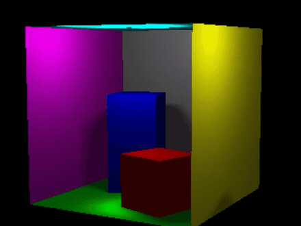
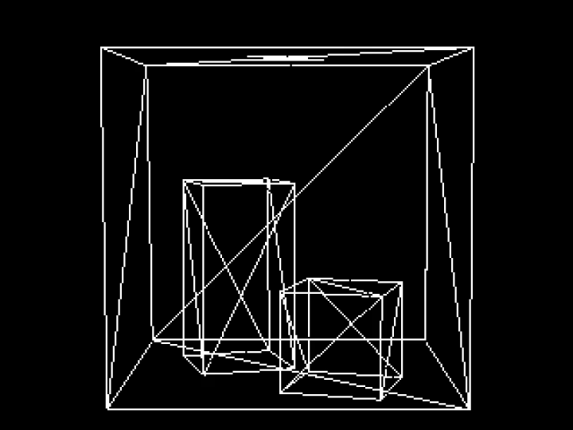
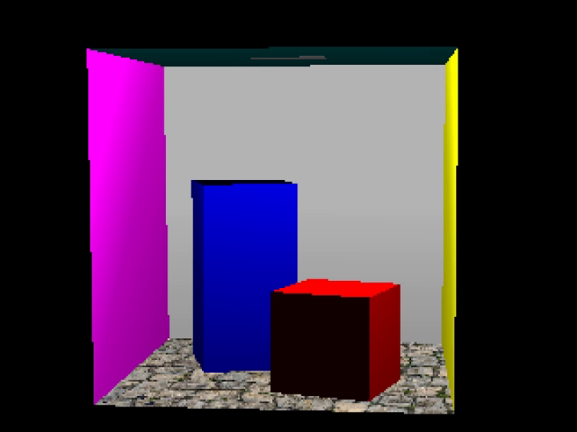
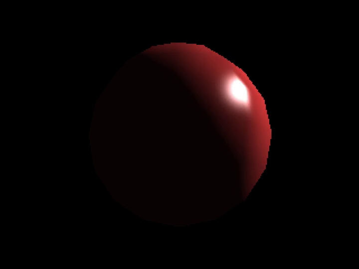
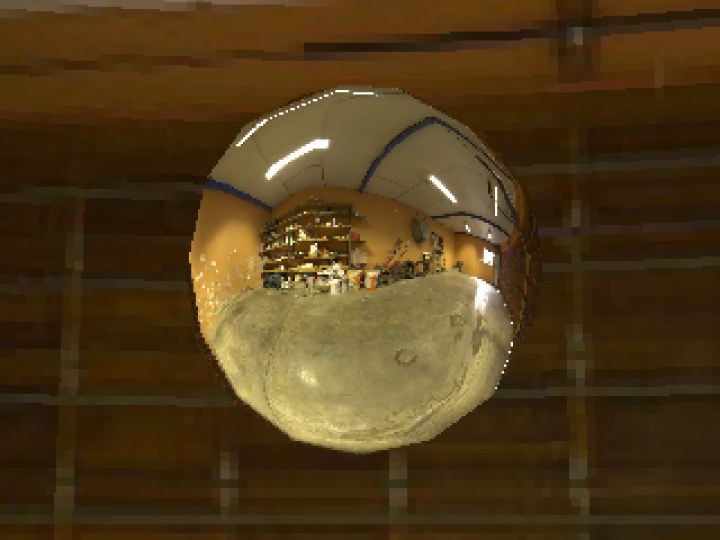
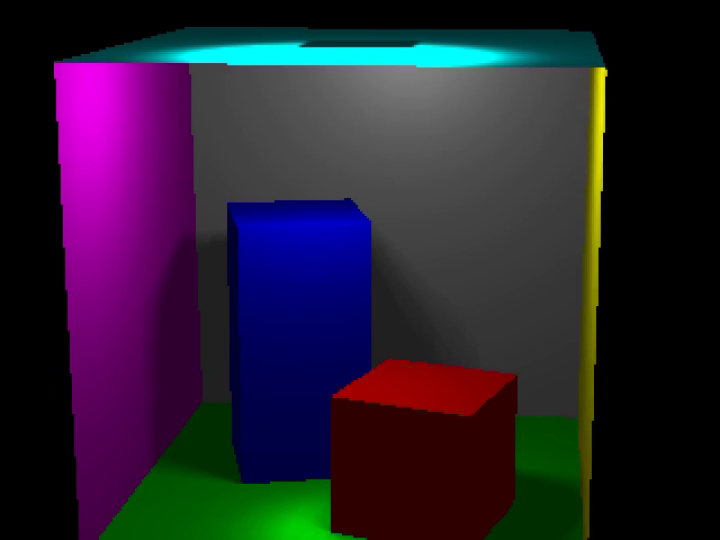
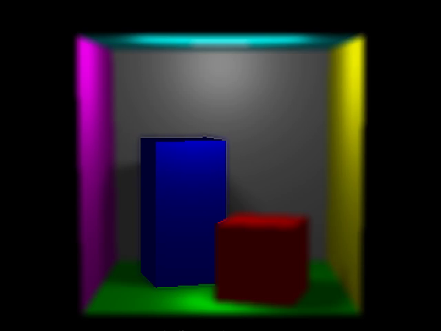
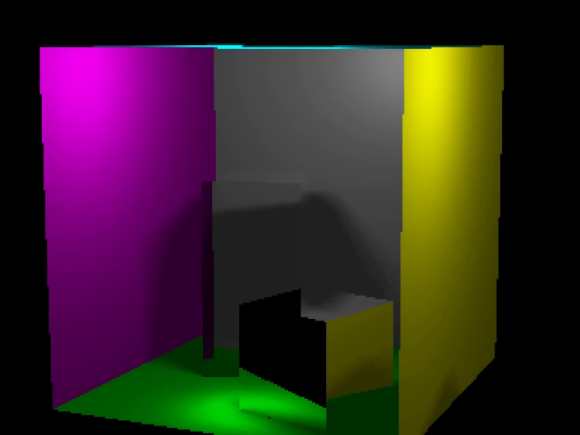
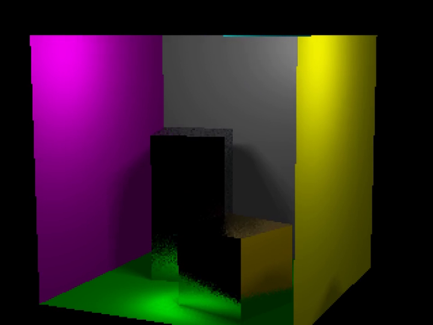

# C++ Software Renderer: Rasteriser + Ray Tracer

A 3D renderer written from scratch in C++, with no graphics API and no GPU. Every pixel is computed on the CPU. It implements two complete pipelines in one program, a z-buffered rasteriser and a recursive ray tracer, and switches between them live. Built for the Computer Graphics unit at the University of Bristol on the course SDL framework (the vendored `libs/sdw` and `glm`); all rendering code in `src/RedNoise.cpp` is my own.

> **Awarded a first class mark.**



Full render reel (about 2 minutes, every feature below): [docs/render-reel.mp4](docs/render-reel.mp4)

## What it does

The renderer loads OBJ geometry with MTL materials and draws it three ways: wireframe, rasterised, and ray traced. The ray tracer adds area light soft shadows, glass, mirrors, glossy metals, depth of field, and environment mapping. A scripted camera sequence walks a Cornell box and a sphere through each technique in turn, which is what the reel above shows.

Everything runs on the CPU at 320x240, with the ray tracer split across all available hardware threads.

## Gallery

| | |
|---|---|
| <br>**Wireframe.** OBJ loaded, projected, and drawn as edges. | <br>**Rasterised.** Filled triangles, z-buffer, perspective correct textured floor. |
| <br>**Phong sphere.** Per pixel specular on a smooth shaded sphere. | <br>**Environment mapping.** A reflective sphere samples an equirectangular panorama. |
| <br>**Ray traced soft shadows.** Area light sampling gives real penumbrae. | <br>**Depth of field.** Thin lens blur with a chosen object held in focus. |
| <br>**Glass + mirror.** Fresnel blended reflection and refraction. | <br>**Glossy metals.** Gold and brushed iron from perturbed reflection rays. |

## Engineering highlights

The parts that were actually hard, and how they work.

**Two renderers, one scene graph.** The same loaded model feeds a rasteriser and a ray tracer. The rasteriser projects triangles to the canvas and fills them with a barycentric edge function, interpolating inverse depth for the z-buffer and interpolating texture coordinates in 1/z space so textures stay perspective correct. The ray tracer instead solves a 3x3 linear system per triangle to find the closest hit, then shades it.

**Soft shadows from an area light.** Instead of one shadow ray per hit, each point samples a 5x5 jittered grid across a light of finite radius and counts how many samples reach it. The fraction that reach the light becomes the shadow term, so edges fade through a penumbra rather than snapping to hard black.

**Glass with Fresnel.** Refractive surfaces trace both a reflected and a refracted ray, apply Snell's law for the bend, handle total internal reflection when the ray cannot exit, and blend the two results with the Schlick approximation so glancing angles turn reflective the way real glass does.

**Glossy metals.** Mirror reflection fires one ray along the reflected direction. Metals fire several rays, each perturbed inside a cone whose width is the material roughness, then average them and apply a colour tint. That is what separates the sharp mirror from the brushed iron and the warm gold.

**Depth of field, two ways.** A physically motivated thin lens mode samples points across an aperture and converges them on a focus plane, so near and far objects blur by how far they sit from focus. A second mode locks focus to whichever material you click, keeps that object sharp, and blurs everything else. Both are driven from the mouse and keyboard at runtime.

**Multithreading.** The ray traced frame is split into horizontal bands, one per hardware thread, and joined before present. The thread count is probed at startup and leaves headroom for the OS.

**A scripted camera.** The animated sequence is a timed state machine that advances through phases, swapping scene, render mode, and material settings on cue and interpolating the camera along eased arcs. It is how the whole feature set is demonstrated in one continuous take.

## Build and run

Needs a C++ compiler and SDL2.

```bash
# Debian / Ubuntu
sudo apt install libsdl2-dev
# macOS
brew install sdl2
```

Then, with Make:

```bash
make speedy     # optimised build, launches the program
```

Other Make targets: `make` (debug build), `make production` (plain optimised), `make diagnostic` (address + UB sanitisers). Each one compiles and then runs the executable.

Or with CMake:

```bash
cmake -Bbuild -H. -DCMAKE_BUILD_TYPE=Release
cmake --build build --target RedNoise -j
./build/RedNoise
```

On launch the program plays the full scripted sequence. To explore the scenes yourself, set `g_playIdent = false` near the top of `src/RedNoise.cpp` and rebuild, then use the controls below.

## Controls

| Key | Action |
|---|---|
| `W` / `R` / `T` | Wireframe / rasterised / ray traced |
| Arrow keys | Pan the camera (left, right, up, down) |
| `Home` / `End` | Dolly the camera in and out |
| `A` / `D` | Orbit left and right around the scene |
| `Z` / `X` | Orbit up and over |
| `I` `J` `K` `L` | Tilt the camera in place |
| `Space` | Toggle continuous orbit |
| `1` / `2` / `3` | Depth of field: off / thin lens / click to focus |
| Left click | Focus on the clicked object (click to focus mode) |
| `[` / `]` | Pull focus nearer and further |
| `6` `7` `8` `9` `0` | Move the light |
| `Esc` | Quit |

## Scenes

Three scenes ship with the renderer: the Cornell box (`cornell-box.obj`), a single sphere for shading and material tests (`sphere.obj`), and the same sphere as a reflective probe against the panorama in `env.ppm`. The floor texture is `texture.ppm`.

## Repository layout

```
src/RedNoise.cpp     all rendering code
libs/sdw             course SDL framework (window, canvas, OBJ types)
libs/glm             vendored maths library
*.obj  *.mtl         scene geometry and materials
*.ppm                floor texture and environment panorama
docs/                stills, hero GIF, and the full reel
```

## Notes

University of Bristol, Computer Graphics coursework, 2025, awarded a first class mark. The renderer, materials, and animation are my own work on top of the provided SDL framework.

If you are currently taking this unit, you are welcome to read the code, but please do not submit any of it as your own. It is shared as a portfolio piece.
